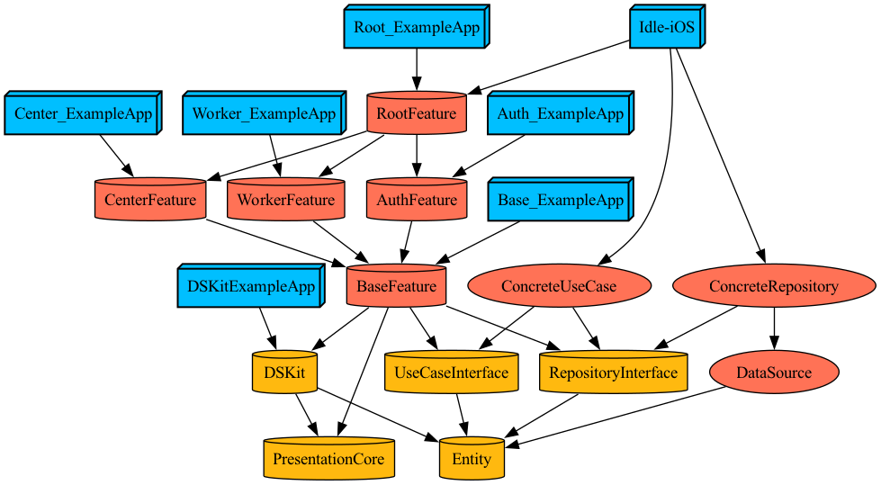

# 케어밋 iOS

## 프로덕트 소개

요양보호사를 구인/구직할 수 있는 채용플랫폼 어플리케이션입니다. 

요양시장은 가파르게 성장하고 있지만, 기존의 채용 시스템은 아날로그식 수기로 진행되거나 특정 직군에 특화되어 있지 않다는 점을 착안하여 시작된 프로젝트입니다.

해당 어플리케이션은 요양보호사중 재가 요양보호사의 구인/구직에 특화되어 있습니다.

## 기능소개

재가 요양보호사는 노인에 집에 방문하여 돌봄 서비스를  제공하는 직군입니다. 요양보호사의 문제는 근무를 시작하기전, 자신이 맡을 노인에 대한 정보를 충분히 얻을 수 없다는 점입니다. 

구인자가 공고작성시 구직자가 필요로하는 노인 정보를 의무적으로 기입하도록 유도함으로써 이 문제를 해결하려고 합니다.

### 센터관리자 기능
<table>
<tr>
<td><b>센터관리자 공고등록</b></td>
<td><b>센터관리자 지원자 확인</b></td>
<td><b>센터관리자 센터 프로필 관리</b></td>
</tr>

<tr>
    
<td>
    
</td>

<td>
    
</td>

<td>
    
</td>

</tr>
    
<tr>
<td><b>센터관리자 공고 마감/삭제</b></td>
<td></td>
<td></td>
</tr>

<tr>
<td>
    
</td>
<td></td>
<td></td>
</tr> 

</table>

### 요양보호사 기능
<table>
<tr>
<td><b>요양보호사 공고 확인</b></td>
<td><b>요양보호사 공고 지원</b></td>
<td><b>요양보호사 프로필 수정</b></td>
</tr>

<tr>

<td>
    
</td>

<td>
    
</td>

<td>
    
</td>

</tr>
</table>

## 기술소개

### 모듈러 아키텍처

- 사용한 이유
    - 모듈단위로 기능을 분할하여 테스트를 용이하게 하였습니다. 
    - 수정이 발생한 모듈을 의존하지 않는 다른 모듈이 재빌드 되는 것을 막아 빌드속도를 향상시켰습니다.
    - **Presentation**의 모듈들은 예시앱(ExampleApp)모듈을 만들어 해당 모듈의 화면을 쉽게 테스트할 수 있었습니다.
        
- Tuist도입
    - 타겟의 `Mash-O`타입에 따라 모듈의 임베딩 방식이 달라져 해당 옵션을 일일히 설정하기 번거로웠습니다.
    - 새로운 모듈을 생성하는 경우 의존하는 모듈들의 `Mash-O`임입을 일일히 확인해야 하는 것이 번거로웠습니다.
    - `tuist graph` 명령어를 사용하여 전체적인 모듈의존구조를 파악하기 쉬웠습니다.
    - Tuist scaffold를 사용해 새로운 모듈 생성을 쉽게할 수 있었습니다.
 

## 모듈 의존성그래프
※ 해당 그래프는 `tuist graph`를 통해 성생했습니다.

### 클린아키텍처

- 사용한 이유
    - 하나의 기능에 대해 객체들의 역할을 분리하고 비슷한 역할을 하는 객체들을 계층화하기 위해 클린아키텍처를 도입하였습니다.
    - 계층간 소통은 인터페이스를 통해 가능하도록 설계하였으며, 의존성 주입을 통해 구체타입을 런타임에 주입시켰습니다.
      이를 통해 실제기능을 도입하기전 **Mock객체를 주입하여 특정 계층의 객체를 집중적으로 테스트**할 수 있었습니다.

### MVVM 디자인 패턴

- 사용한 이유
  - 비지니스 로직을 View와 분리하기위해 사용했습니다.
  - View는 UI표현이외에 관심사에서 최대한 격리하여 재사용성을 높일 수 있었습니다.

## Router

`Router`타입은 프로그램 내에서 네비게이션 역할을 담당하도록했습니다.
1. push를 통해 RootController(**UINavigationController**)에 화면을 삽입합니다.
2. RootController에 모달화면을 present합니다.
3. 3번 기능을 바탕으로 재사용 가능한 UI(스낵바, 기본Alert, 커스텀Alert)를 관리하도록 했습니다.

## 코디네이터(Coordinator)

코디네이터는 ViewModel과 ViewController를 생성하고 두 객체사이를 **매게(bind)하는 역할**을 수행합니다.
그리고 Router가 수행할 수 있는 작업을 ViewModel에 전달하여 유저상호작용이 화면전환에 개입할 수 있도록 합니다.

### 코디네이터 구조

AppCoordinator는 최상단 코디네이터 입니다. 
최상단 코디네이터는 여러가지 화면에 대한 Flow를 가지며, Flow가 Flow를 호출할 수 있는 경우 AppCoordinator를 통해 서로에게 접근할 수 있도록 설계했습니다.
종속관계가 필요한 경우는 계층화를 하였습니다.
아래 사진에 같은 색을 가지는 Flow는 같은 객체내에 구현되어 있어 서로에게 접근이 가능합니다.

