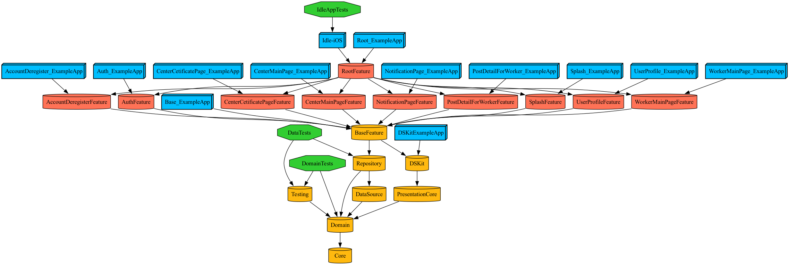

# 케어밋 iOS

## 프로덕트 소개

요양보호사를 구인/구직할 수 있는 채용플랫폼 어플리케이션입니다. 

요양시장은 가파르게 성장하고 있지만, 기존의 채용 시스템은 아날로그식 수기로 진행되거나 특정 직군에 특화되어 있지 않다는 점을 착안하여 시작된 프로젝트입니다.

해당 어플리케이션은 요양보호사중 재가 요양보호사의 구인/구직에 특화되어 있습니다.

## 기능소개

재가 요양보호사는 노인에 집에 방문하여 돌봄 서비스를  제공하는 직군입니다. 요양보호사의 문제는 근무를 시작하기전, 자신이 맡을 노인에 대한 정보를 충분히 얻을 수 없다는 점입니다. 

구인자가 공고작성시 구직자가 필요로하는 노인 정보를 의무적으로 기입하도록 유도함으로써 이 문제를 해결하려고 합니다.

요양보호사는 센터가 작성한 공고를 확인하고 공고에 지원할 수 있습니다.

## 기술소개

### 모듈러 아키텍처

- 사용한 이유
    - 모듈단위로 기능을 분할하여 테스트를 용이하게 하고 빌드속도를 향상하기 위해서입니다.
    - Preview의 잦은 버그로 인해 모듈별로 Example앱을 두어 기능을 시뮬레이터로 테스트하기 위해서 입니다.
        
- Tuist를 사용한 이유
    - 타겟의 Mash-O타입에따라 임베딩 방식이 달라져 일일히 설정하기 번거로웠습니다.
        
        새로운 모듈을 생성하는 경우 의존하는 모듈들의 Mash-O타입을 일일히 확인해야 하는 것이 번거로웠습니다.
        
    - `tuist graph` 명령어를 사용하여 전체적인 모듈의존구조를 파악하기 쉬웠습니다. 의존구조를 가시적으로 파악한 후 Tuist가 제공하는 전이 의존기능을 통해 특정 모듈 하나만 의존해도 해당 모듈이 의존하는 다른 모듈들을 전이 의존할 수 있어 빠른 모듈세팅이 가능했습니다.

### 클린아키텍처

- 사용한 이유
    - 의존성 주입을 통해 앱 내 모든 모듈과 파일에 일관된 비즈니스 로직을 제공했습니다. 이를 통해 특정 비즈니스 로직을 조작하거나 테스트 객체를 만들어 앱 테스트를 용이하게 할 수 있었습니다.
    - 하나의 기능을 수행하는 데 필요한 책임을 계층화하여 세분화함으로써, 계층별로 테스트를 쉽게 진행할 수 있도록 했습니다.

### MVVM+RxSwift

- 사용한 이유
    - 비즈니스로직과 UI를 분리하여 UI 재사용성을 높이기 위해서 사용했습니다.
    - UI는 bind함수의 매개변수로 ViewModel을 전달받아 바인딩 관계를 맻습니다.
        
        RxSwift를 사용하여 옵저버와 옵저버블의 구독관계로 구현하였습니다.

## 모듈 의존성그래프

